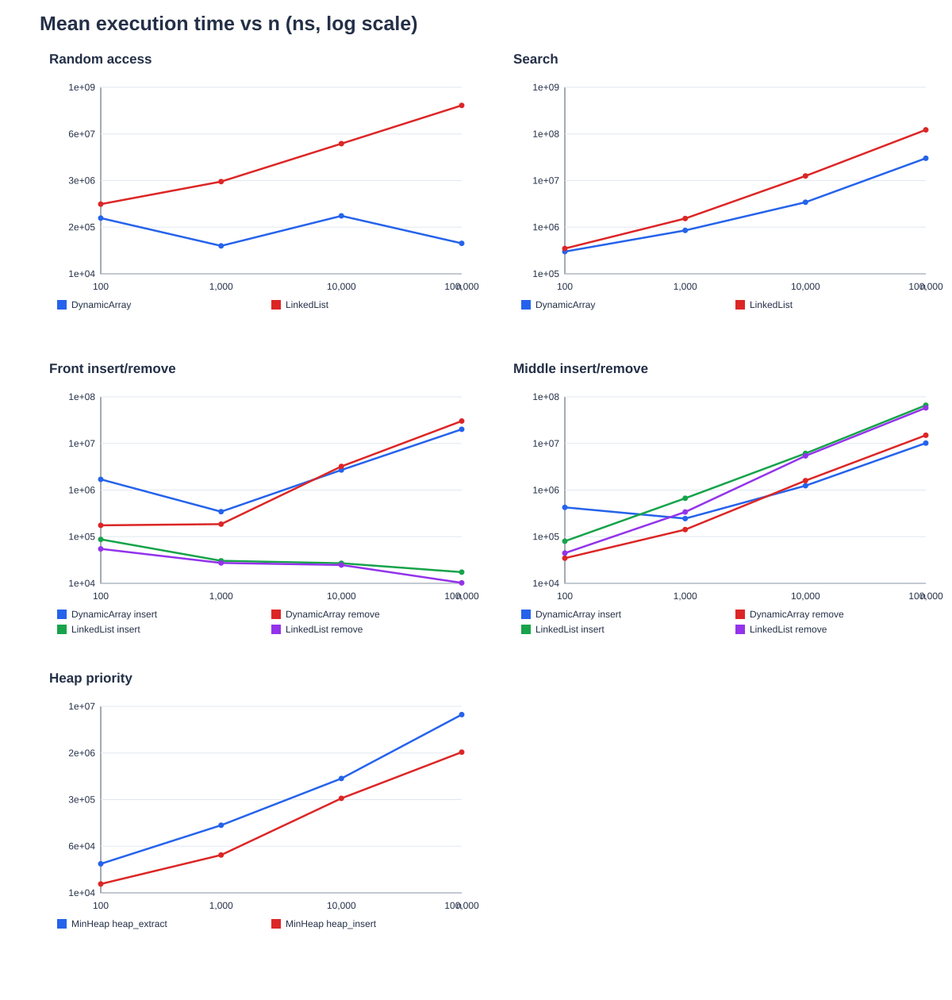
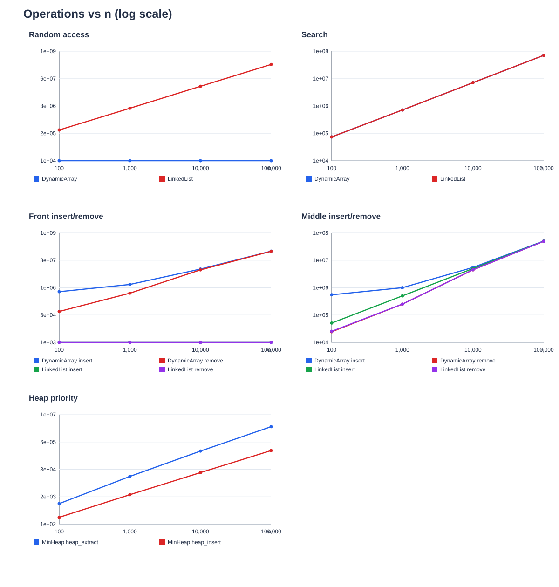

# Assignment 2: Data Structures

## Project overview

This project implements and compares three data structures in Java:

- `DynamicArray`: an array that grows when it becomes full.
- `LinkedList`: a doubly linked list.
- `MinHeap`: a binary heap that keeps the smallest value at the top.

Each structure is implemented from scratch. Java collections are used only in the correctness tests.

## How to run

Use Java 17 or newer. Run these commands from the `assignment2` folder:

```powershell
$classes = "target/classes"
New-Item -ItemType Directory -Force $classes | Out-Null
$sources = Get-ChildItem src/main/java -Filter *.java -Recurse | ForEach-Object FullName
javac -encoding UTF-8 -d $classes $sources
java -cp $classes daa.assignment2.Main --test
java -cp $classes daa.assignment2.Main --benchmark results/results.csv
```

The test command prints `PASS: 407914 checks`.

## Complexity analysis

`n` is the number of stored elements. Space means extra space for one operation. `Θ` describes a tight bound; the same bound also gives an `O` upper bound and an `Ω` lower bound.

| Structure | Operation | Best | Average | Worst | Extra space |
|---|---|---|---|---|---|
| Dynamic array | `add(x)` | Θ(1) | Θ(1) amortized | Θ(n) when growing | Θ(1), or Θ(n) when growing |
| Dynamic array | `add(i,x)` | Θ(1) at end | Θ(n) | Θ(n) | Θ(1), or Θ(n) when growing |
| Dynamic array | `remove(i)` | Θ(1) at end | Θ(n) | Θ(n) | Θ(1) |
| Dynamic array | `get(i)` | Θ(1) | Θ(1) | Θ(1) | Θ(1) |
| Dynamic array | `contains(x)` | Θ(1) | Θ(n) | Θ(n) | Θ(1) |
| Linked list | `add(x)` | Θ(1) | Θ(1) | Θ(1) | Θ(1) |
| Linked list | `add(i,x)` | Θ(1) at an end | Θ(n) | Θ(n) | Θ(1) |
| Linked list | `remove(i)` | Θ(1) at an end | Θ(n) | Θ(n) | Θ(1) |
| Linked list | `get(i)` | Θ(1) at an end | Θ(n) | Θ(n) | Θ(1) |
| Linked list | `contains(x)` | Θ(1) | Θ(n) | Θ(n) | Θ(1) |
| Min-heap | `insert(x)` | Θ(1) | Θ(1) for random keys | Θ(n) if growing; Θ(log n) otherwise | Θ(1), or Θ(n) when growing |
| Min-heap | `peekMin()` | Θ(1) | Θ(1) | Θ(1) | Θ(1) |
| Min-heap | `extractMin()` | Θ(1) | Θ(log n) | Θ(log n) | Θ(1) |

Array access is direct, but insertion and removal may shift many values. A linked list changes only a few links at the front, but reaching a middle index takes time. Heap insertion moves upward and extraction moves downward through at most `log n` levels. The average insert bound for the heap assumes independent random keys; for arbitrary inputs, use `O(log n)` apart from resizing.

## Correctness

**Dynamic-array insertion.** Before each iteration of the shift loop at index `i`, the old elements from `i` to the old end have already moved one position right, and elements before `i` are unchanged. At the start, `i` equals the old size, so the moved part is empty. Each iteration copies the unchanged element at `i-1` into `i`, preserving the invariant. The loop stops at the insertion index. All old elements from that index onward have moved right, so placing the new value at the index gives the correct order. Capacity is checked before shifting.

**Heap extraction.** After removing the root, the last value is held aside and its destination is a hole at the root. Before each iteration, the two subtrees below the hole are valid heaps; only the held value still needs a position. The loop chooses the smaller child and moves it into the hole if it is smaller than the held value. This keeps the parent valid and moves the hole one level down. The loop ends at a leaf or when the held value is no larger than its children. Putting it in the hole restores the heap property. The old root returned by the operation was the minimum.

## Experimental setup

Each experiment uses `n = 100, 1,000, 10,000, 100,000`, runs five times, and reports mean time from `System.nanoTime()`. Random seeds are fixed: 42 for values, 43 for indices, and 44 for search queries. Input is generated before timing.

The workloads are 10,000 random reads; 1,000 searches; 1,000 front and middle insertions/removals; and `n` heap insertions followed by `n` extractions. For `n=100`, 1,000 removals cannot be done from one structure. The benchmark restores the original structure between removal batches, outside the timed sections. The middle index is the original `n/2`.

The CSV records time, element accesses, movements, and comparisons. Heap extraction also checks that values come out in non-decreasing order.

## Results

The [complete tables](results/tables.md) and [raw CSV](results/results.csv) contain all sizes and workloads. The graphs show measured time and operation counts:





At `n=100,000`, 10,000 random reads took about **0.066 ms** with the array and **328 ms** with the list. For 1,000 front insertions, the array took **20.2 ms** and the list **0.017 ms**. For 1,000 searches, both made about **70.8 million comparisons**, but the array ran faster. In the heap, 100,000 insertions took **1.83 ms** and 100,000 extractions **7.36 ms**.

## Discussion

The operation counts follow the expected growth: array reads stay constant, list reads and searches grow with `n`, array front edits shift more values, and heap operations grow slowly per element. Timings can vary because of JVM warm-up, memory layout, cache behavior, and other running processes. This explains why algorithms with the same Big-O complexity can have different measured times.

## Design recommendations

Use a dynamic array for frequent indexed reads and scans. Use a linked list when most edits happen at the front or at an already known node. Use a min-heap when the next smallest value must be retrieved repeatedly. The best structure depends on which operations the program performs most often.

## Testing and conclusion

Tests compare the implementations with `ArrayList` and `PriorityQueue`. They cover empty and single-element structures, duplicates, boundary and invalid indices, large inputs, heap order after updates, and sorted extraction. All **407,914 checks pass**. The measurements agree with the main theoretical predictions.

## AI acknowledgement

AI assisted with the code, report, and graph presentation. The numbers in the tables and graphs came from the Java benchmark; they were not invented by AI.
